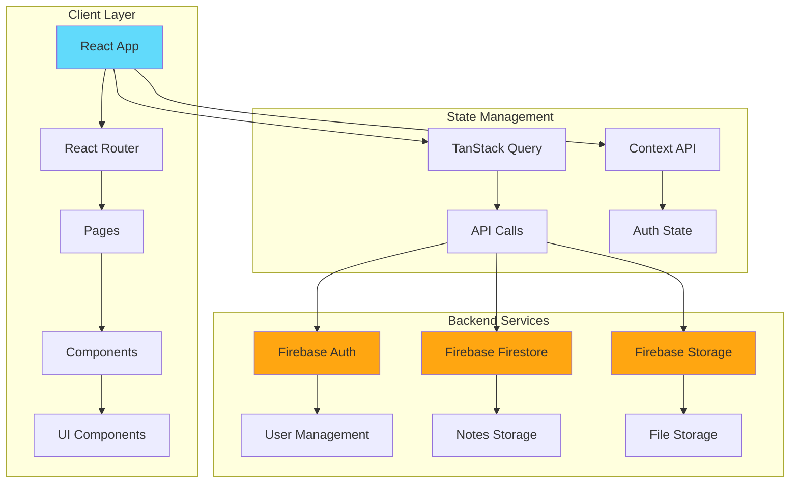
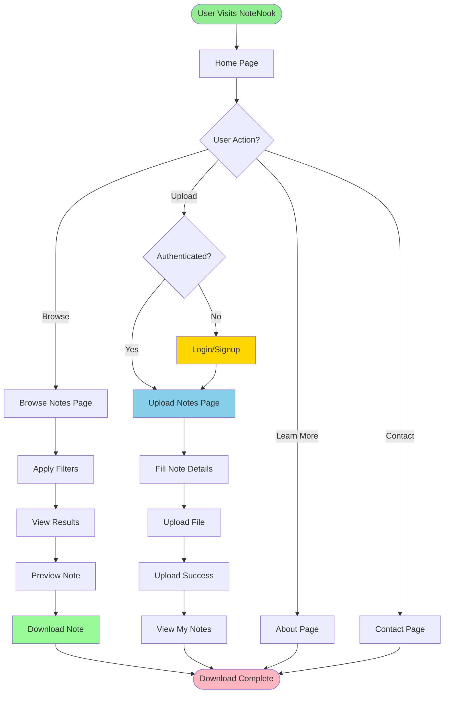

# 📚 NoteNook

<div align="center">


**A Modern Platform for Students to Share, Browse, and Download Academic Notes**

[](https://vitejs.dev/)
[](https://reactjs.org/)
[](https://www.typescriptlang.org/)
[](https://tailwindcss.com/)
[](LICENSE)

[Demo](https://lovable.dev/projects/3ee5bd2f-575e-4990-9570-70c0cbc59855) • [Report Bug](https://github.com/Yash-Kavaiya/note-nook-orange/issues) • [Request Feature](https://github.com/Yash-Kavaiya/note-nook-orange/issues)

</div>

---

## 📋 Table of Contents

- [About the Project](#-about-the-project)
- [Features](#-features)
- [Technology Stack](#-technology-stack)
- [Architecture](#-architecture)
- [User Flow](#-user-flow)
- [Getting Started](#-getting-started)
- [Project Structure](#-project-structure)
- [Usage](#-usage)
- [Development](#-development)
- [Deployment](#-deployment)
- [Contributing](#-contributing)
- [License](#-license)
- [Contact](#-contact)

---

## 🎯 About the Project

**NoteNook** is a collaborative platform designed to revolutionize the way students share and access academic notes. Whether you're looking to upload your meticulously crafted study materials or searching for notes on a specific subject, NoteNook makes it simple and intuitive.

### Key Highlights

- 🚀 **Fast & Responsive** - Built with modern web technologies for optimal performance
- 🎨 **Beautiful UI** - Clean, modern interface powered by shadcn-ui and Tailwind CSS
- 🔍 **Smart Filtering** - Filter notes by subject, college, and more
- 📱 **Mobile-Friendly** - Fully responsive design works on all devices
- 🔐 **Secure** - Firebase authentication for secure user management

---

## ✨ Features

| Feature | Description | Status |
|---------|-------------|--------|
| 📤 **Note Upload** | Upload and share your notes with the community | ✅ Active |
| 🔍 **Smart Browse** | Filter notes by subject, college, and keywords | ✅ Active |
| 📥 **Easy Download** | Download notes in various formats | ✅ Active |
| 🎓 **Subject Tags** | Organize notes with subject categorization | ✅ Active |
| 🏫 **College Filter** | Find notes specific to your institution | ✅ Active |
| 👤 **User Profiles** | Manage your uploads and favorites | ✅ Active |
| 💬 **Community** | Connect with fellow students | 🚧 Coming Soon |
| ⭐ **Rating System** | Rate and review notes | 🚧 Coming Soon |

---

## 🛠️ Technology Stack

### Frontend Technologies

| Technology | Version | Purpose |
|------------|---------|---------|
| **React** | 18.3.1 | UI framework for building interactive interfaces |
| **TypeScript** | 5.8.3 | Type-safe JavaScript for better development experience |
| **Vite** | 5.4.19 | Next-generation frontend build tool |
| **React Router** | 6.30.1 | Client-side routing and navigation |
| **Tailwind CSS** | 3.4.17 | Utility-first CSS framework |
| **shadcn-ui** | Latest | Beautiful, accessible component library |

### Backend & Services

| Service | Purpose |
|---------|---------|
| **Firebase** | Authentication and database |
| **Lovable** | Development and deployment platform |

### UI Components & Libraries

| Library | Purpose |
|---------|---------|
| **Radix UI** | Accessible, unstyled component primitives |
| **Lucide React** | Beautiful icon library |
| **React Hook Form** | Performant form management |
| **TanStack Query** | Powerful data synchronization |
| **Recharts** | Composable charting library |
| **Sonner** | Toast notifications |

---

## 🏗️ Architecture



### Application Architecture

The application follows a modern React architecture with:

- **Component-Based Design**: Modular, reusable components
- **Type Safety**: Full TypeScript integration
- **State Management**: Context API for global state, TanStack Query for server state
- **Authentication**: Firebase Authentication for secure user management
- **Database**: Firebase Firestore for real-time data synchronization
- **Storage**: Firebase Storage for file uploads

---

## 🔄 User Flow



---

## 🚀 Getting Started

### Prerequisites

Before you begin, ensure you have the following installed:

- **Node.js** (v18 or higher) - [Download](https://nodejs.org/)
- **npm** or **yarn** - Comes with Node.js
- **Git** - [Download](https://git-scm.com/)

### Installation

1. **Clone the repository**

```bash
git clone https://github.com/Yash-Kavaiya/note-nook-orange.git
cd note-nook-orange
```

2. **Install dependencies**

```bash
npm install
# or
yarn install
```

3. **Set up environment variables**

Create a `.env` file in the root directory and add your Firebase configuration:

```env
VITE_FIREBASE_API_KEY=your_api_key
VITE_FIREBASE_AUTH_DOMAIN=your_auth_domain
VITE_FIREBASE_PROJECT_ID=your_project_id
VITE_FIREBASE_STORAGE_BUCKET=your_storage_bucket
VITE_FIREBASE_MESSAGING_SENDER_ID=your_sender_id
VITE_FIREBASE_APP_ID=your_app_id
```

4. **Start the development server**

```bash
npm run dev
# or
yarn dev
```

5. **Open your browser**

Navigate to `http://localhost:5173` to see the application running.

---

## 📁 Project Structure

```
note-nook-orange/
├── public/                 # Static assets
│   ├── robots.txt         # SEO robots file
│   └── ...
├── src/
│   ├── assets/            # Images, fonts, and other assets
│   ├── components/        # React components
│   │   ├── landing/       # Landing page components
│   │   ├── layout/        # Layout components (Navbar, Footer)
│   │   └── ui/            # Reusable UI components (shadcn-ui)
│   ├── contexts/          # React Context providers
│   │   └── AuthContext.tsx
│   ├── hooks/             # Custom React hooks
│   ├── lib/               # Utility functions and libraries
│   ├── pages/             # Page components
│   │   ├── Index.tsx      # Home page
│   │   ├── Browse.tsx     # Browse notes page
│   │   ├── Upload.tsx     # Upload notes page
│   │   ├── Download.tsx   # Download page
│   │   ├── About.tsx      # About page
│   │   ├── Contact.tsx    # Contact page
│   │   └── NotFound.tsx   # 404 page
│   ├── App.tsx            # Main app component
│   ├── main.tsx           # Application entry point
│   └── index.css          # Global styles
├── .gitignore             # Git ignore file
├── components.json        # shadcn-ui configuration
├── eslint.config.js       # ESLint configuration
├── index.html             # HTML template
├── package.json           # Dependencies and scripts
├── tailwind.config.ts     # Tailwind CSS configuration
├── tsconfig.json          # TypeScript configuration
├── vite.config.ts         # Vite configuration
└── README.md              # This file
```

---

## 💻 Usage

### For Students

1. **Browse Notes**
   - Visit the Browse page to explore available notes
   - Use filters to find notes by subject, college, or keywords
   - Preview notes before downloading

2. **Upload Notes**
   - Sign in or create an account
   - Navigate to the Upload page
   - Fill in note details (title, subject, college)
   - Upload your file
   - Submit to share with the community

3. **Download Notes**
   - Find the notes you need
   - Click the download button
   - Access the file on your device

### For Developers

#### Available Scripts

| Command | Description |
|---------|-------------|
| `npm run dev` | Start development server with hot reload |
| `npm run build` | Build for production |
| `npm run build:dev` | Build for development environment |
| `npm run lint` | Run ESLint to check code quality |
| `npm run preview` | Preview production build locally |

---

## 🔧 Development

### Development Workflow

1. **Local Development**
   ```bash
   npm run dev
   ```
   The app will be available at `http://localhost:5173`

2. **Linting**
   ```bash
   npm run lint
   ```

3. **Building**
   ```bash
   npm run build
   ```

### Using Lovable

You can also edit this project using [Lovable](https://lovable.dev/projects/3ee5bd2f-575e-4990-9570-70c0cbc59855):

- Simply visit the Lovable Project and start prompting
- Changes made via Lovable will be committed automatically to this repo
- Pull the changes to sync with your local environment

### Using GitHub Codespaces

1. Navigate to the main page of this repository
2. Click on the "Code" button (green button) near the top right
3. Select the "Codespaces" tab
4. Click on "New codespace" to launch a new Codespace environment
5. Edit files directly within the Codespace

---

## 🚢 Deployment

### Deploy with Lovable

The easiest way to deploy NoteNook:

1. Open [Lovable](https://lovable.dev/projects/3ee5bd2f-575e-4990-9570-70c0cbc59855)
2. Click on **Share → Publish**
3. Your app will be live instantly!

### Custom Domain

To connect a custom domain:

1. Navigate to **Project > Settings > Domains**
2. Click **Connect Domain**
3. Follow the setup instructions

Read more: [Setting up a custom domain](https://docs.lovable.dev/tips-tricks/custom-domain#step-by-step-guide)

### Deploy to Other Platforms

NoteNook can be deployed to any static hosting service:

- **Vercel**: Connect your GitHub repository
- **Netlify**: Drag and drop the `dist` folder
- **GitHub Pages**: Use GitHub Actions for automatic deployment

---

## 🤝 Contributing

Contributions are what make the open-source community such an amazing place to learn, inspire, and create. Any contributions you make are **greatly appreciated**.

### How to Contribute

1. **Fork the Project**
2. **Create your Feature Branch**
   ```bash
   git checkout -b feature/AmazingFeature
   ```
3. **Commit your Changes**
   ```bash
   git commit -m 'Add some AmazingFeature'
   ```
4. **Push to the Branch**
   ```bash
   git push origin feature/AmazingFeature
   ```
5. **Open a Pull Request**

### Contribution Guidelines

- Follow the existing code style and conventions
- Write clear, descriptive commit messages
- Update documentation as needed
- Add tests for new features
- Ensure all tests pass before submitting

---

## 📄 License

Distributed under the MIT License. See `LICENSE` file for more information.

---

## 📞 Contact

**Project Maintainer**: Yash Kavaiya

- GitHub: [@Yash-Kavaiya](https://github.com/Yash-Kavaiya)
- Project Link: [https://github.com/Yash-Kavaiya/note-nook-orange](https://github.com/Yash-Kavaiya/note-nook-orange)
- Live Demo: [https://lovable.dev/projects/3ee5bd2f-575e-4990-9570-70c0cbc59855](https://lovable.dev/projects/3ee5bd2f-575e-4990-9570-70c0cbc59855)

---

## 🙏 Acknowledgments

- [shadcn-ui](https://ui.shadcn.com/) for the beautiful component library
- [Tailwind CSS](https://tailwindcss.com/) for the utility-first CSS framework
- [Lucide Icons](https://lucide.dev/) for the icon set
- [Firebase](https://firebase.google.com/) for backend services
- [Lovable](https://lovable.dev/) for the development platform
- All contributors who have helped shape NoteNook

---

<div align="center">

**Made with ❤️ by students, for students**

⭐ Star this repo if you find it helpful!

</div>
